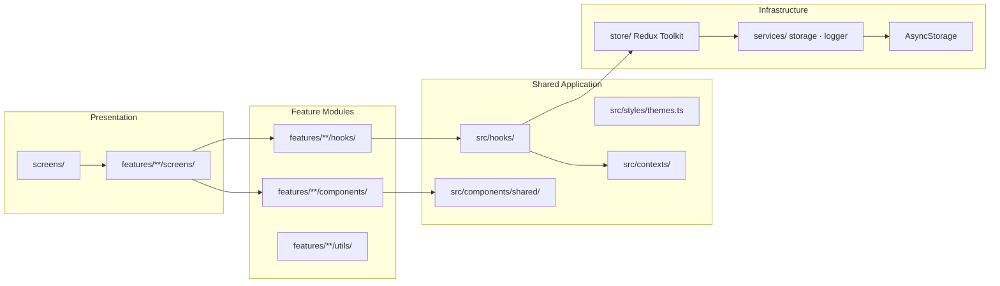
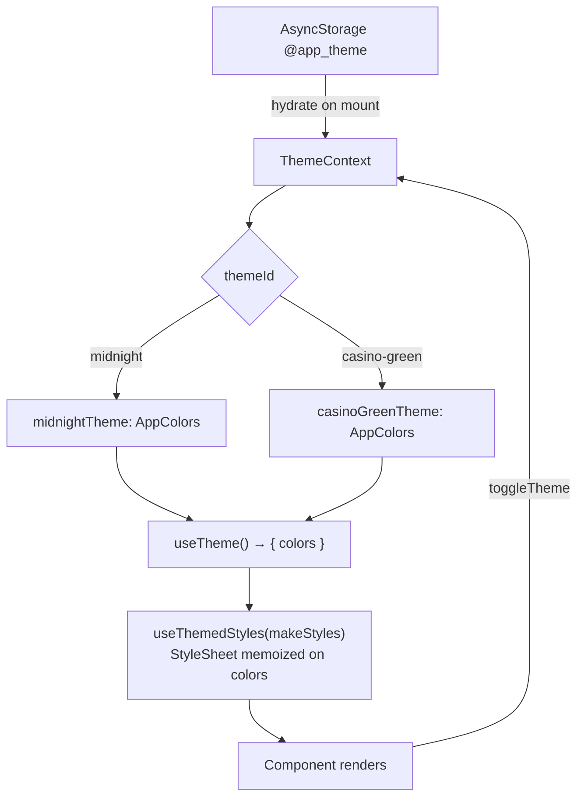
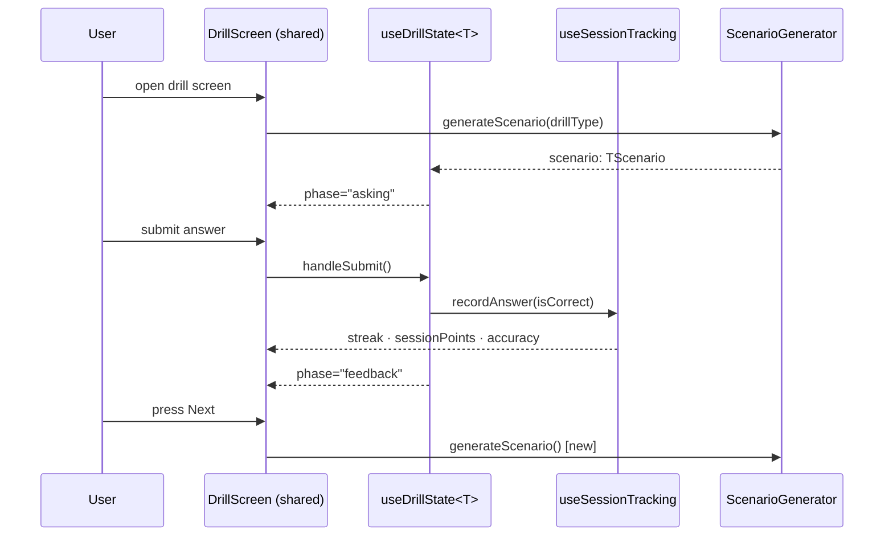

# Architecture Overview

Updated: 2026-03-18
Owner: @ivans

## Purpose

Summarize system architecture and where to find implementation rules. For coding standards and merge gate see `.ai/standards/coding-guide.md`.

---

## System Shape

- **Platform**: React Native (Expo) + TypeScript strict
- **State**: Redux slices for feature state + selectors; Context for app-wide settings and theme
- **Persistence**: AsyncStorage (local) via `src/services/storage.service.ts` + `src/constants/storageKeys.ts`
- **Theming**: Custom dual-theme system — `midnightTheme` and `casinoGreenTheme`, toggled via `ThemeContext`
- **Testing**: Jest 30 + React Native Testing Library (1094 tests, 142 suites)

---

## Layer Organization



**Cross-feature imports are prohibited.** Features communicate only through top-level shared modules (`src/hooks/`, `src/components/shared/`, `src/utils/`, `src/types/`).

---

## Theme System



All components must use `colors.*` from `useTheme()`. Hardcoded hex values are a P0 violation.

Pattern:
```typescript
const { colors } = useTheme();
const styles = useThemedStyles(makeStyles);
// Outside the component:
function makeStyles(colors: ReturnType<typeof useTheme>['colors']) {
  return StyleSheet.create({ ... });
}
```

---

## Drill Training Data Flow

All five poker-game drill screens (BJ · TCP · CP · THU · RK) share this flow through two generic hooks.



- `DrillScreen` renders UI phases — resides at `src/components/shared/DrillScreen/`
- `DrillMenuScreen` renders drill selection — resides at `src/components/shared/DrillMenuScreen/`
- Both are generic; feature-specific logic lives entirely in the `ScenarioGenerator`

---

## Hook Hierarchy

| Hook | Location | Used by |
|---|---|---|
| `useDrillState<T>` | `src/hooks/useDrillState.ts` | All 5 poker-game drill screens |
| `useSessionTracking` | `src/hooks/useSessionTracking.ts` | All drill screens + PLO training |
| `useThemedStyles` | `src/hooks/useThemedStyles.ts` | 44+ components |
| `useRouletteTrainingSession` | `src/hooks/` | Sector + Position training screens |
| `useModalState` | `src/hooks/` | Modal-bearing screens |

---

## Real Code References

| Concept | File |
|---|---|
| Redux store root | `src/store/index.ts` |
| Feature example (BJ) | `src/features/blackjack-training/` |
| Shared drill menu | `src/components/shared/DrillMenuScreen/` |
| Shared drill runner | `src/components/shared/DrillScreen/` |
| Storage service | `src/services/storage.service.ts` |
| Storage keys | `src/constants/storageKeys.ts` |
| App navigation | `src/navigation/AppNavigator.tsx` |
| Theme definitions | `src/styles/themes.ts` |
| BaseDrillScenario type | `src/types/drill.types.ts` |

---

## Read Next

1. `.ai/architecture/clean-architecture.md`
2. `.ai/architecture/patterns.md`
3. `.ai/architecture/feature-structure.md`
4. `.ai/workflows/adding-feature.md`
5. `CONTRIBUTING.md` — step-by-step: add a new training module
