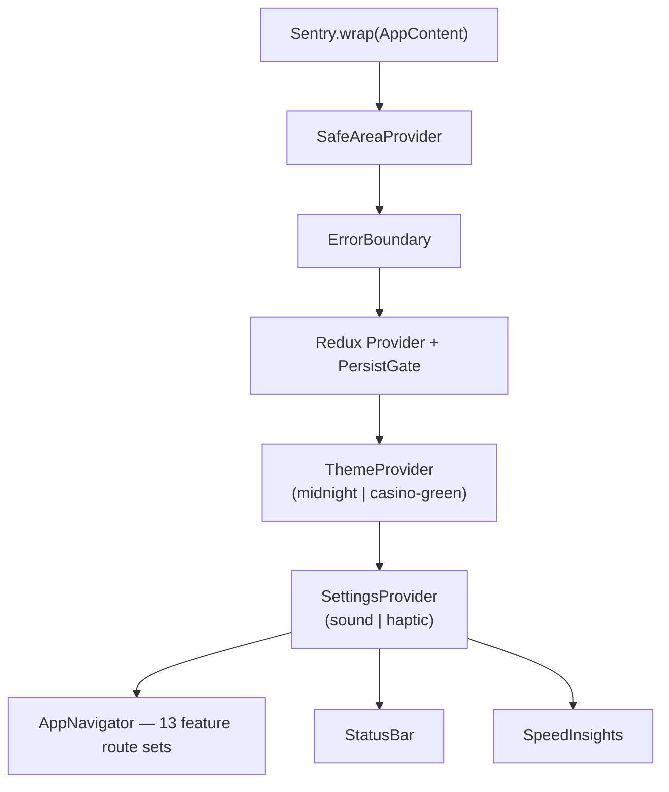

[](https://github.com/IvanSemov44/CasinoTrainingApp/actions/workflows/ci.yml)
[](https://www.typescriptlang.org/)
[](https://reactnative.dev/)
[](https://expo.dev/)
[](./jest.config.js)
[](./README.md)

# Casino Dealer Training Academy

Professional training app for casino dealers — roulette payouts, poker game procedures, and chip conversions.

<p align="center">
  
</p>

## Overview

A React Native (Expo) application covering 12 training modules across roulette and poker disciplines. Each module uses a streak-based scoring system with progressive difficulty. Runs on Android, iOS, and as a PWA in the browser.

## Training Modules

| Category | Module | Key Skills |
|---|---|---|
| Roulette | 🎰 Roulette Training | Payouts · Splits · Streets · Speed drills |
| Roulette | 🎯 Sector Training | Number → Sector (Voisins / Tiers / Orphelins / Zero) |
| Roulette | 📍 Position Training | Number → Racetrack clock position |
| Roulette | 💰 Cash Conversion | Chip exchange calculations |
| Roulette | 📚 Roulette Knowledge | Rules · Limits · Announced bet chip counts |
| Roulette | 🎡 Roulette Game | Live simulation with racetrack & announced bets |
| Poker | 🂡 Blackjack | 3:2 payout · Insurance · Super Seven · Odd bets |
| Poker | 🃏 Three Card Poker | Qualify · Ante Bonus payouts (4:1 / 3:1 / 1:1) |
| Poker | 🌴 Caribbean Poker | Swap mechanics · €1 Bonus · A-K qualification |
| Poker | 🤠 Texas Hold'em Ultimate | Blind · Trips Plus · 3×/4× pre-flop raise |
| Poker | 📣 Call Bets | Voisins · Tiers · Orphelins · Zero chip counts |
| Poker | ♠️ Pot Limit Omaha | Dealing order · Multi-street pot calculation |

## Tech Stack

| Layer | Technology |
|---|---|
| Framework | React Native 0.81 + Expo 54 |
| Language | TypeScript 5.9 (strict) |
| State | Redux Toolkit + redux-persist |
| Navigation | React Navigation 7 (stack) |
| Themes | Custom dual-theme system (Midnight / Casino Green) |
| Storage | AsyncStorage (offline-first) |
| Graphics | React Native SVG + Reanimated 4 |
| Monitoring | Sentry · Vercel Speed Insights |
| Testing | Jest 30 + React Native Testing Library |
| CI/CD | GitHub Actions (quality · test · build-web) |

## Project Structure

```
src/
├── components/shared/       # DrillMenuScreen · DrillScreen · AccentModeCard · NumberPad …
├── contexts/                # ThemeContext (midnight | casino-green) · SettingsContext
├── features/                # 13 self-contained feature modules
│   ├── blackjack-training/
│   ├── call-bets-training/
│   ├── caribbean-poker-training/
│   ├── cash-conversion-training/
│   ├── plo-training/
│   ├── racetrack/
│   ├── racetrack-position-training/
│   ├── racetrack-sector-training/
│   ├── roulette-game/
│   ├── roulette-knowledge-training/
│   ├── roulette-training/
│   ├── texas-holdem-ultimate-training/
│   └── three-card-poker-training/
├── hooks/                   # useDrillState · useSessionTracking · useThemedStyles …
├── navigation/              # AppNavigator — flat stack with 13 feature route sets
├── screens/                 # HomeScreen · SettingsScreen · ProgressScreen
├── services/                # storage · logger · analytics · performance
├── store/                   # Redux Toolkit (rouletteSlice)
├── styles/                  # themes.ts · spacing · textStyles · containerStyles
├── types/                   # drill.types · roulette.types · navigation.types
└── utils/                   # cardUtils · randomUtils · hand evaluators
```

Each feature follows the **colocation pattern** — screens, tests, types, and hooks live together:

```
features/blackjack-training/
├── constants/drills.ts          # Drill menu items array
├── screens/BJMenuScreen/
│   ├── BJMenuScreen.tsx
│   ├── BJMenuScreen.test.tsx
│   ├── BJMenuScreen.types.ts
│   └── index.ts
├── screens/BJDrillScreen/
├── types/index.ts
├── utils/scenarioGenerator.ts
└── navigation.tsx
```

## Getting Started

```bash
# 1. Clone
git clone https://github.com/IvanSemov44/CasinoTrainingApp.git
cd CasinoTrainingApp

# 2. Install
npm install

# 3. Start
npm start
```

## Running the App

| Platform | Command |
|---|---|
| Android | `npm run android` |
| iOS (macOS only) | `npm run ios` |
| Web / PWA | `npm run web` |
| Expo Go (scan QR) | `npm start` |

## Testing

```bash
npm test                  # run all tests
npm run test:coverage     # with coverage report
npm run test:watch        # watch mode
npx tsc --noEmit          # TypeScript check
npm run lint              # ESLint
```

1094 tests across 142 test suites. All hooks, utilities, and components have colocated `.test.tsx` files.

## Architecture

### Provider Stack



### Shared Drill Architecture

All five poker-game drill screens (BJ, TCP, CP, THU, RK) are powered by two shared hooks:

- [`src/hooks/useDrillState.ts`](src/hooks/useDrillState.ts) — scenario state, phase (`asking` / `feedback`), answer validation
- [`src/hooks/useSessionTracking.ts`](src/hooks/useSessionTracking.ts) — streak, session points, accuracy

See [`.ai/architecture/overview.md`](.ai/architecture/overview.md) for full architecture diagrams.

## Documentation

| Resource | Purpose |
|---|---|
| [`.ai/README.md`](.ai/README.md) | AI assistant entry point — read order guide |
| [`.ai/standards/coding-guide.md`](.ai/standards/coding-guide.md) | Merge gate + Definition of Done |
| [`.ai/architecture/overview.md`](.ai/architecture/overview.md) | System diagrams — layers, data flow, theme system |
| [`CONTRIBUTING.md`](CONTRIBUTING.md) | How to add a new training module |
| [`CHANGELOG.md`](CHANGELOG.md) | Version history |

## License

Proprietary and confidential. All rights reserved.
