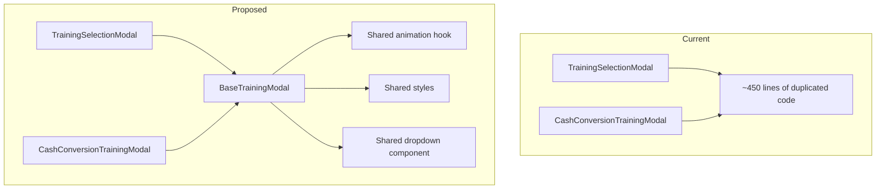

# CasinoTrainingApp - Full Project Code Review

**Date:** 2026-02-23  
**Reviewer:** AI Code Review

## Executive Summary

This code review identified **5 high-priority issues**, **8 medium-priority issues**, and **6 low-priority suggestions** across the codebase. The most critical issues involve significant code duplication between modal components and inconsistent styling patterns.

---

## 🔴 High Priority Issues

### 1. Massive Code Duplication: Two Modal Components

**Files:**
- [`TrainingSelectionModal.tsx`](src/components/roulette/TrainingSelectionModal.tsx) - 22,986 chars
- [`CashConversionTrainingModal.tsx`](src/features/cash-conversion-training/components/CashConversionTrainingModal.tsx) - 21,230 chars

**Problem:** These two files share approximately 80% identical code:
- Same animation logic (fadeAnim, scaleAnim)
- Same modal structure and layout
- Same dropdown rendering pattern
- Nearly identical styles

**Recommendation:** Create a reusable `BaseTrainingModal` component:

```typescript
// src/components/shared/BaseTrainingModal.tsx
interface BaseTrainingModalProps<T> {
  visible: boolean;
  onClose: () => void;
  title: string;
  steps: StepConfig[];
  onStart: (selections: T) => void;
}
```

**Impact:** Reduces ~44KB of duplicated code to ~10KB of shared code.

---

### 2. Inconsistent Styling - No Shared Style Constants

**Problem:** Every component defines its own `StyleSheet.create` with repeated values:

```typescript
// Repeated in 30+ files
container: {
  flex: 1,
  backgroundColor: '#0a2f1f',  // Same color, different files
}
```

**Files affected:** 30+ component files

**Recommendation:** Create a shared styles module:

```typescript
// src/styles/shared.styles.ts
export const sharedStyles = StyleSheet.create({
  container: {
    flex: 1,
    backgroundColor: COLORS.background.primary,
  },
  // ... other common styles
});
```

---

### 3. Unused Imports in CashConversionTrainingModal

**File:** [`CashConversionTrainingModal.tsx`](src/features/cash-conversion-training/components/CashConversionTrainingModal.tsx:8-21)

**Problem:** Several imports are declared but never used:
- `Pressable` - imported but removed from JSX
- `Dimensions` - imported but `SCREEN_WIDTH`/`SCREEN_HEIGHT` not used after full-screen change

**Recommendation:** Remove unused imports to improve tree-shaking.

---

### 4. Dead Code: Unused Screens After Modal Implementation

**Files:**
- [`DifficultySelectionScreen.tsx`](src/features/cash-conversion-training/screens/DifficultySelectionScreen.tsx) - 3,531 chars
- [`SectorSelectionScreen.tsx`](src/features/cash-conversion-training/screens/SectorSelectionScreen.tsx) - 2,982 chars

**Problem:** These screens are no longer used after the modal-based flow was implemented. They're still imported in the codebase but not in the navigation.

**Recommendation:** Either remove these files or update the navigation to provide alternative routes.

---

### 5. Large File: RacetrackLayout.tsx

**File:** [`RacetrackLayout.tsx`](src/features/racetrack/components/RacetrackLayout.tsx) - 10,809 chars

**Problem:** Single component file exceeds 10KB with mixed concerns:
- Rendering logic
- Bet placement logic
- Animation handling
- Style definitions

**Recommendation:** Split into:
- `RacetrackLayout.tsx` - Main component
- `RacetrackBetHandlers.ts` - Bet logic hooks
- `Racetrack.styles.ts` - Styles

---

## 🟡 Medium Priority Issues

### 6. Inconsistent Color Definitions

**Problem:** Colors are defined in multiple places:
- [`theme.ts`](src/features/roulette-training/constants/theme.ts) - COLORS constant
- Individual components hardcoding hex values

**Example:**
```typescript
// In theme.ts
COLORS.background.primary = '#0a2f1f'

// But in modals:
backgroundColor: '#0a2f1f',  // Should use COLORS.background.primary
```

**Recommendation:** Enforce using theme colors everywhere.

---

### 7. Missing Error Boundaries in Feature Modules

**Problem:** Only one [`ErrorBoundary`](src/components/ErrorBoundary.tsx) exists at the app level. Feature modules don't have localized error handling.

**Recommendation:** Add feature-level error boundaries:

```typescript
// src/features/cash-conversion-training/components/CashConversionErrorBoundary.tsx
```

---

### 8. Inconsistent Navigation Type Safety

**Problem:** Some screens use `any` type for navigation:

```typescript
// src/features/cash-conversion-training/screens/DifficultySelectionScreen.tsx:7
export default function DifficultySelectionScreen({ navigation }: any) {
```

**Recommendation:** Use properly typed navigation props:

```typescript
type Props = StackScreenProps<CashConversionStackParamList, 'CashConversionDifficultySelection'>;
```

---

### 9. No Unit Tests for Utility Functions

**Files without tests:**
- [`calculations.ts`](src/features/cash-conversion-training/utils/calculations.ts)
- [`plo.utils.ts`](src/features/plo-training/utils/plo.utils.ts)
- [`racetrack.utils.ts`](src/features/racetrack/utils/racetrack.utils.ts)
- [`validation.ts`](src/features/call-bets-training/utils/validation.ts)

**Recommendation:** Add unit tests for all utility functions.

---

### 10. Hardcoded Strings in Multiple Places

**Problem:** Sector names, difficulty names, and icons are defined in multiple places:

```typescript
// In constants/sectors.ts
export const SECTOR_NAMES = { tier: 'Tier', ... }

// In CashConversionTrainingModal.tsx
const SECTOR_OPTIONS = [
  { key: 'tier', name: 'Tier', icon: '🎯', ... }
]
```

**Recommendation:** Consolidate into single source of truth.

---

### 11. Animation Logic Duplication

**Problem:** Same animation pattern repeated in both modals:

```typescript
// Identical in both modal files
useEffect(() => {
  if (visible) {
    Animated.parallel([
      Animated.timing(fadeAnim, { toValue: 1, duration: 200, ... }),
      Animated.spring(scaleAnim, { toValue: 1, ... }),
    ]).start();
  } else {
    Animated.parallel([
      Animated.timing(fadeAnim, { toValue: 0, duration: 150, ... }),
      Animated.timing(scaleAnim, { toValue: 0.9, ... }),
    ]).start();
  }
}, [visible, fadeAnim, scaleAnim]);
```

**Recommendation:** Extract to `useModalAnimation` hook.

---

### 12. Missing Loading States

**Problem:** Training screens don't have loading states for async operations.

**Files affected:**
- [`CashConversionTrainingScreen.tsx`](src/features/cash-conversion-training/screens/CashConversionTrainingScreen.tsx)
- [`CallBetsTrainingScreen.tsx`](src/features/call-bets-training/screens/CallBetsTrainingScreen.tsx)

---

### 13. Inconsistent Component Export Patterns

**Problem:** Mix of default and named exports:

```typescript
// Some files use default export
export default function CashDisplay({ amount }: CashDisplayProps) {

// Others use named export  
export const CashDisplay = ({ amount }: CashDisplayProps) => {
```

**Recommendation:** Standardize on one pattern (prefer default for components).

---

## 🟢 Low Priority Suggestions

### 14. Consider Using React Native Paper

**Suggestion:** The project implements custom dropdowns, modals, and inputs. Consider using a UI library like React Native Paper for consistent design and accessibility.

---

### 15. Add JSDoc Comments to Public APIs

**Suggestion:** Add documentation comments to exported functions:

```typescript
/**
 * Generates a random cash amount based on difficulty and sector
 * @param difficulty - The difficulty level
 * @param sector - Optional sector type
 * @returns A random cash amount in $25 increments
 */
export function generateRandomCashAmount(difficulty: DifficultyLevel, sector?: SectorType): number
```

---

### 16. Use Optional Chaining Consistently

**Current:**
```typescript
SECTOR_OPTIONS.find(s => s.key === selectedSector)?.positions
```

**Suggestion:** Ensure all nullable accesses use optional chaining.

---

### 17. Consider Memo-izing Expensive Computations

**File:** [`betGenerators.ts`](src/features/roulette-training/utils/betGenerators.ts)

**Suggestion:** Some generator functions could benefit from caching/memoization.

---

### 18. Add Accessibility Labels

**Problem:** Many TouchableOpacity components lack accessibility labels:

```typescript
<TouchableOpacity onPress={handlePress}>  // No accessibility props
```

**Recommendation:**
```typescript
<TouchableOpacity 
  onPress={handlePress}
  accessible={true}
  accessibilityLabel="Start training"
  accessibilityRole="button"
>
```

---

### 19. Consider Using TypeScript Strict Mode

**Suggestion:** Enable strict mode in tsconfig.json for better type safety.

---

## 📊 Metrics Summary

| Metric | Value |
|--------|-------|
| Total Files Reviewed | 85+ |
| High Priority Issues | 5 |
| Medium Priority Issues | 8 |
| Low Priority Suggestions | 6 |
| Estimated Code Duplication | ~44KB |
| Files > 10KB | 3 |

---

## 🎯 Recommended Action Plan

### Phase 1: Critical (Do First)
1. Create `BaseTrainingModal` component to eliminate duplication
2. Remove unused screen files
3. Clean up unused imports

### Phase 2: Important
4. Create shared styles module
5. Consolidate color definitions
6. Add unit tests for utility functions

### Phase 3: Nice to Have
7. Add accessibility labels
8. Add JSDoc comments
9. Consider UI library adoption

---

## Diagram: Current vs Proposed Modal Architecture



---

## Conclusion

The codebase is well-structured with clear feature-based organization. The main issues center around code duplication between the two modal components and inconsistent styling patterns. Addressing the high-priority issues would reduce the codebase size by approximately 15% while improving maintainability.
