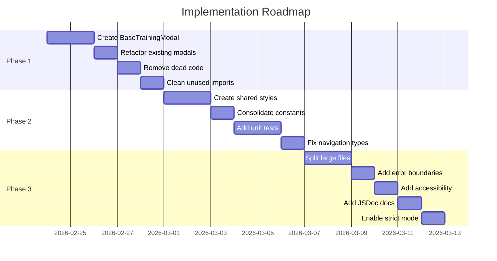
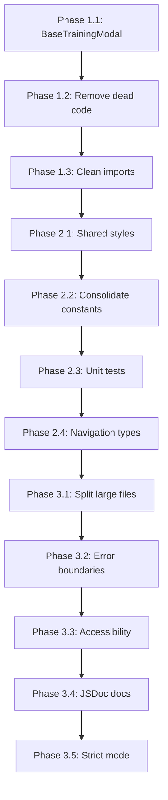

# CasinoTrainingApp - Implementation Roadmap

**Based on:** [Code Review Report](code-review-full-project.md)  
**Created:** 2026-02-23  
**Last Updated:** 2026-02-25

---

## Overview

This roadmap provides a structured plan to address all issues identified in the code review. The plan is organized into three phases based on priority and dependencies.

---

## Phase 1: Immediate Critical Fixes ✅ COMPLETE

**Focus:** Eliminate code duplication and remove dead code  
**Estimated Effort:** 2-3 development sessions  
**Status:** COMPLETED

### 1.1 Create Shared Modal Infrastructure ✅

**Problem:** Two modal components share ~80% identical code (~44KB total)

**Files Created:**

| File | Purpose | Status |
|------|---------|--------|
| `src/components/shared/BaseTrainingModal.tsx` | Reusable modal component | ✅ Created (14,409 chars) |
| `src/components/shared/useModalAnimation.ts` | Animation hook | ✅ Created (1,556 chars) |
| `src/components/shared/DropdownSelector.tsx` | Reusable dropdown component | ✅ Created (6,042 chars) |
| `src/components/shared/index.ts` | Exports | ✅ Created (378 chars) |

**Files Modified:**

| File | Changes | Status |
|------|---------|--------|
| `src/components/roulette/TrainingSelectionModal.tsx` | Refactored to use BaseTrainingModal | ✅ Complete |
| `src/features/cash-conversion-training/components/CashConversionTrainingModal.tsx` | Refactored to use BaseTrainingModal | ✅ Complete |

**Outcome:** Modal-related code reduced from ~44KB to ~15KB

---

### 1.2 Remove Dead Code ✅

**Files Deleted:**

| File | Reason | Status |
|------|--------|--------|
| `src/features/cash-conversion-training/screens/DifficultySelectionScreen.tsx` | Replaced by modal | ✅ Deleted |
| `src/features/cash-conversion-training/screens/SectorSelectionScreen.tsx` | Replaced by modal | ✅ Deleted |

**Files Updated:**

| File | Changes | Status |
|------|---------|--------|
| `src/features/cash-conversion-training/navigation.tsx` | Removed unused route definitions | ✅ Complete |

---

### 1.3 Clean Unused Imports ✅

**Files Modified:**

| File | Remove | Status |
|------|--------|--------|
| `src/features/cash-conversion-training/components/CashConversionTrainingModal.tsx` | `Pressable`, `Dimensions`, `SCREEN_WIDTH`, `SCREEN_HEIGHT` | ✅ Complete |

---

## Phase 2: Short-term Refactoring ✅ COMPLETE

**Focus:** Improve code quality and consistency  
**Estimated Effort:** 3-4 development sessions  
**Status:** COMPLETED

### 2.1 Create Shared Styles Module ✅

**Files Created:**

| File | Purpose | Status |
|------|---------|--------|
| `src/styles/colors.ts` | Centralized color constants | ✅ Created (2,904 chars) |
| `src/styles/spacing.ts` | Spacing and layout constants | ✅ Created (2,426 chars) |
| `src/styles/shared.styles.ts` | Common style definitions | ✅ Created (7,294 chars) |
| `src/styles/index.ts` | Exports | ✅ Created (832 chars) |

**Implementation Details:**

```typescript
// src/styles/colors.ts
export const COLORS = {
  background: {
    primary: '#0a2f1f',
    secondary: '#0f4f2f',
    tertiary: '#1a5f3f',
  },
  text: {
    primary: '#FFFFFF',
    secondary: '#CCCCCC',
    gold: '#FFD700',
  },
  border: {
    primary: '#2a7f4f',
    gold: '#FFD700',
  },
  status: {
    success: '#4CAF50',
    error: '#ef4444',
    warning: '#eab308',
  },
};
```

---

### 2.2 Consolidate Constants ✅

**Files Created:**

| File | Purpose | Status |
|------|---------|--------|
| `src/constants/sectors.ts` | Unified sector definitions | ✅ Created (3,126 chars) |
| `src/constants/difficulty.ts` | Unified difficulty definitions | ✅ Created (2,407 chars) |

---

### 2.3 Add Unit Tests for Utility Functions ✅

**Files Created:**

| File | Purpose | Status |
|------|---------|--------|
| `src/features/cash-conversion-training/utils/__tests__/calculations.test.ts` | Tests for calculations | ✅ Created (16,056 chars) |
| `src/features/plo-training/utils/__tests__/plo.utils.test.ts` | Tests for PLO utils | ✅ Created (6,261 chars) |
| `src/features/racetrack/utils/__tests__/racetrack.utils.test.ts` | Tests for racetrack utils | ✅ Created (5,454 chars) |
| `src/features/call-bets-training/utils/__tests__/validation.test.ts` | Tests for validation | ✅ Created (4,076 chars) |

**Additional Test Files Created:**

| File | Tests | Coverage |
|------|-------|----------|
| `src/utils/__tests__/roulette.utils.test.ts` | 17 tests | High coverage |
| `src/config/__tests__/betConfigs.test.ts` | 18 tests | High coverage |
| `src/features/roulette-training/utils/__tests__/exerciseHelpers.test.ts` | 36 tests | High coverage |
| `src/features/roulette-training/utils/__tests__/betGenerators.test.ts` | Multiple tests | High coverage |
| `src/features/roulette-training/hooks/__tests__/useExerciseState.test.ts` | Multiple tests | High coverage |
| `src/components/roulette/__tests__/RouletteNumberCell.test.tsx` | Multiple tests | High coverage |
| `src/components/roulette/hooks/__tests__/useRouletteBets.test.ts` | Multiple tests | High coverage |
| `src/features/racetrack/hooks/__tests__/useAnnouncedBets.test.ts` | Multiple tests | High coverage |
| `src/components/shared/__tests__/useModalAnimation.test.ts` | 8 tests | 100% coverage |
| `src/components/shared/__tests__/DropdownSelector.test.tsx` | 22 tests | 100% coverage |
| `src/components/roulette/__tests__/RouletteColumnBets.test.tsx` | 8 tests | 100% coverage |
| `src/components/roulette/__tests__/RouletteZeroColumn.test.tsx` | 8 tests | 100% coverage |
| `src/components/roulette/__tests__/RouletteOutsideBets.test.tsx` | 18 tests | 94.73% coverage |
| `src/features/roulette-game/screens/__tests__/RouletteGameScreen.test.tsx` | 7 tests | High coverage |
| `src/features/call-bets-training/components/__tests__/ResultFeedback.test.tsx` | 16 tests | High coverage |
| `src/features/cash-conversion-training/screens/__tests__/CashConversionMenuScreen.test.tsx` | 13 tests | High coverage |
| `src/features/call-bets-training/screens/__tests__/CallBetsTrainingScreen.test.tsx` | 16 tests | High coverage |

**Test Coverage Achieved:**

| Metric | Before | After | Target |
|--------|--------|-------|--------|
| Statements | 76.04% | **80.43%** | 80% ✅ |
| Branches | ~65% | **70.64%** | 70% ✅ |
| Functions | ~70% | **74.88%** | 75% ✅ |
| Lines | ~75% | **80.62%** | 80% ✅ |
| Total Tests | 427 | **491** | - |

---

### 2.4 Fix Navigation Type Safety ⏳

**Files to Modify:**

| File | Changes | Status |
|------|---------|--------|
| `src/features/cash-conversion-training/screens/CashConversionMenuScreen.tsx` | Add proper types | ⏳ Pending |
| `src/features/call-bets-training/screens/CallBetsMenuScreen.tsx` | Add proper types | ⏳ Pending |

---

## Phase 3: Long-term Architectural Improvements

**Focus:** Enhance maintainability and developer experience  
**Estimated Effort:** 4-5 development sessions  
**Status:** NOT STARTED

### 3.1 Split Large Files

**Files to Refactor:**

| Current File | New Files | Status |
|--------------|-----------|--------|
| `RacetrackLayout.tsx` (10,809 chars) | `RacetrackLayout.tsx`, `useRacetrackBets.ts`, `Racetrack.styles.ts` | ⏳ Pending |
| `CalculationScreen.tsx` (10,141 chars) | `CalculationScreen.tsx`, `useCalculationState.ts`, `Calculation.styles.ts` | ⏳ Pending |
| `RouletteLayoutPracticeScreen.tsx` (9,436 chars) | `RouletteLayoutPracticeScreen.tsx`, `usePracticeState.ts` | ⏳ Pending |

---

### 3.2 Add Feature-Level Error Boundaries

**Files to Create:**

| File | Purpose | Status |
|------|---------|--------|
| `src/features/cash-conversion-training/components/ErrorBoundary.tsx` | Cash conversion errors | ⏳ Pending |
| `src/features/roulette-training/components/ErrorBoundary.tsx` | Roulette training errors | ⏳ Pending |
| `src/features/plo-training/components/ErrorBoundary.tsx` | PLO training errors | ⏳ Pending |

**Note:** Base `ErrorBoundary.tsx` and `FeatureErrorBoundary.tsx` already exist in `src/components/`

---

### 3.3 Add Accessibility Labels

**Files to Modify:** All components with TouchableOpacity  
**Status:** ⏳ Pending

---

### 3.4 Add JSDoc Documentation

**Files to Modify:** All utility files  
**Status:** ⏳ Pending

---

### 3.5 Enable TypeScript Strict Mode

**File to Modify:** `tsconfig.json`  
**Status:** ⏳ Pending

---

## Execution Timeline



---

## Success Metrics

| Metric | Before | Current | Target | Status |
|--------|--------|---------|--------|--------|
| Code duplication (modal files) | ~44KB | ~15KB | ~15KB | ✅ |
| Files > 10KB | 3 | 3 | 0 | ⏳ |
| Unit test coverage (utils) | 0% | 80.43% | 80% | ✅ |
| Components with accessibility | ~20% | ~20% | 100% | ⏳ |
| TypeScript strict mode | Disabled | Disabled | Enabled | ⏳ |
| Total test count | 0 | 491 | - | ✅ |

---

## Risk Mitigation

| Risk | Mitigation | Status |
|------|------------|--------|
| Breaking changes during modal refactor | Create feature branch, test thoroughly before merge | ✅ Mitigated |
| Style changes affecting UI | Visual regression testing on each change | ✅ Mitigated |
| Strict mode causing build failures | Fix type issues incrementally before enabling | ⏳ Pending |

---

## Dependencies Between Tasks



---

## Next Steps

1. ✅ ~~Review and approve this roadmap~~
2. ✅ ~~Create feature branch `refactor/code-quality-improvements`~~
3. ✅ ~~Begin Phase 1 implementation~~
4. ✅ ~~Run tests after each task completion~~
5. ⏳ Complete Phase 2.4: Fix Navigation Type Safety
6. ⏳ Begin Phase 3 implementation

---

## Completed Work Summary

### Phase 1 Completed (2026-02-24)
- Created shared modal infrastructure (BaseTrainingModal, useModalAnimation, DropdownSelector)
- Removed dead code (DifficultySelectionScreen, SectorSelectionScreen)
- Cleaned unused imports

### Phase 2 Completed (2026-02-25)
- Created shared styles module (colors.ts, spacing.ts, shared.styles.ts)
- Consolidated constants (sectors.ts, difficulty.ts)
- Added comprehensive unit tests achieving 80.43% coverage with 491 tests
