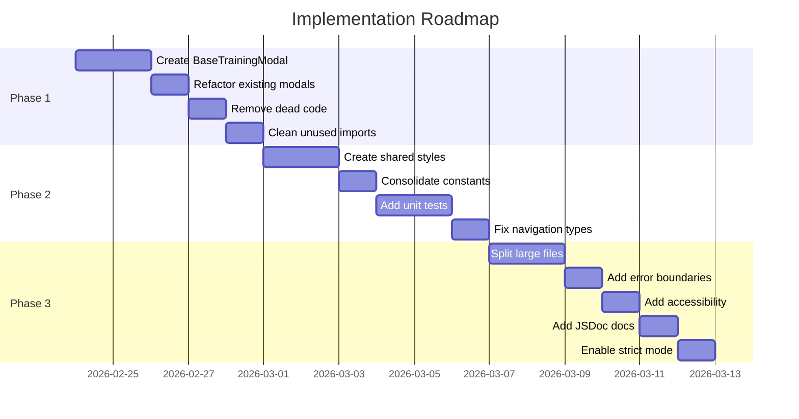
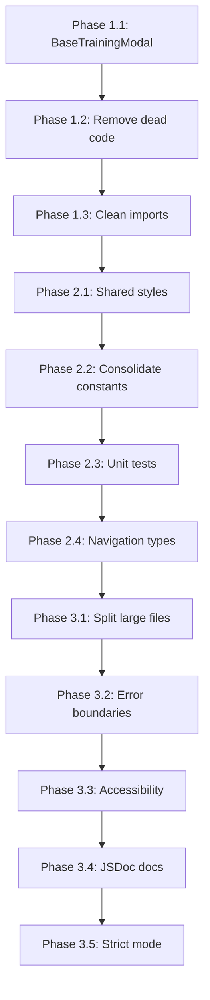

# CasinoTrainingApp - Implementation Roadmap

**Based on:** [Code Review Report](code-review-full-project.md)  
**Created:** 2026-02-23

---

## Overview

This roadmap provides a structured plan to address all issues identified in the code review. The plan is organized into three phases based on priority and dependencies.

---

## Phase 1: Immediate Critical Fixes

**Focus:** Eliminate code duplication and remove dead code  
**Estimated Effort:** 2-3 development sessions

### 1.1 Create Shared Modal Infrastructure

**Problem:** Two modal components share ~80% identical code (~44KB total)

**Files to Create:**

| File | Purpose |
|------|---------|
| `src/components/shared/BaseTrainingModal.tsx` | Reusable modal component |
| `src/components/shared/useModalAnimation.ts` | Animation hook |
| `src/components/shared/DropdownSelector.tsx` | Reusable dropdown component |
| `src/components/shared/index.ts` | Exports |

**Files to Modify:**

| File | Changes |
|------|---------|
| `src/components/roulette/TrainingSelectionModal.tsx` | Refactor to use BaseTrainingModal |
| `src/features/cash-conversion-training/components/CashConversionTrainingModal.tsx` | Refactor to use BaseTrainingModal |

**Technical Approach:**

```typescript
// src/components/shared/useModalAnimation.ts
import { useRef, useEffect } from 'react';
import { Animated } from 'react-native';

export function useModalAnimation(visible: boolean) {
  const fadeAnim = useRef(new Animated.Value(0)).current;
  const scaleAnim = useRef(new Animated.Value(0.9)).current;

  useEffect(() => {
    if (visible) {
      Animated.parallel([
        Animated.timing(fadeAnim, {
          toValue: 1,
          duration: 200,
          useNativeDriver: true,
        }),
        Animated.spring(scaleAnim, {
          toValue: 1,
          friction: 8,
          tension: 65,
          useNativeDriver: true,
        }),
      ]).start();
    } else {
      Animated.parallel([
        Animated.timing(fadeAnim, {
          toValue: 0,
          duration: 150,
          useNativeDriver: true,
        }),
        Animated.timing(scaleAnim, {
          toValue: 0.9,
          duration: 150,
          useNativeDriver: true,
        }),
      ]).start();
    }
  }, [visible, fadeAnim, scaleAnim]);

  return { fadeAnim, scaleAnim };
}
```

```typescript
// src/components/shared/DropdownSelector.tsx
interface DropdownItem {
  key: string;
  label: string;
  icon?: string;
  extraInfo?: string;
}

interface DropdownSelectorProps {
  label: string;
  placeholder: string;
  items: DropdownItem[];
  selectedKey: string | null;
  onSelect: (key: string) => void;
  showDropdown: boolean;
  onToggleDropdown: () => void;
}

export function DropdownSelector({ ... }: DropdownSelectorProps) {
  // Shared dropdown implementation
}
```

```typescript
// src/components/shared/BaseTrainingModal.tsx
interface StepConfig {
  number: number;
  title: string;
  items: DropdownItem[];
  selectedKey: string | null;
  onSelect: (key: string) => void;
  showDropdown: boolean;
  onToggleDropdown: () => void;
  optional?: boolean;
}

interface BaseTrainingModalProps {
  visible: boolean;
  onClose: () => void;
  title: string;
  steps: StepConfig[];
  summaryItems: { label: string; value: string }[];
  canStart: boolean;
  onStart: () => void;
}

export function BaseTrainingModal({ ... }: BaseTrainingModalProps) {
  const { fadeAnim, scaleAnim } = useModalAnimation(visible);
  // Shared modal implementation
}
```

**Expected Outcome:** Reduce modal-related code from ~44KB to ~15KB

---

### 1.2 Remove Dead Code

**Files to Delete:**

| File | Reason |
|------|--------|
| `src/features/cash-conversion-training/screens/DifficultySelectionScreen.tsx` | Replaced by modal |
| `src/features/cash-conversion-training/screens/SectorSelectionScreen.tsx` | Replaced by modal |

**Files to Update:**

| File | Changes |
|------|---------|
| `src/features/cash-conversion-training/navigation.tsx` | Remove unused route definitions |

**Technical Approach:**

1. Verify no imports reference the deleted files
2. Update navigation types to remove unused routes
3. Run TypeScript compilation to confirm no errors

---

### 1.3 Clean Unused Imports

**Files to Modify:**

| File | Remove |
|------|--------|
| `src/features/cash-conversion-training/components/CashConversionTrainingModal.tsx` | `Pressable`, `Dimensions`, `SCREEN_WIDTH`, `SCREEN_HEIGHT` |

**Technical Approach:**

```typescript
// Before
import {
  View,
  Text,
  TouchableOpacity,
  Modal,
  Animated,
  Pressable,        // REMOVE
  ScrollView,
  Dimensions,       // REMOVE
  Platform,
  StyleSheet,
  TextInput,
} from 'react-native';

const { width: SCREEN_WIDTH, height: SCREEN_HEIGHT } = Dimensions.get('window'); // REMOVE

// After
import {
  View,
  Text,
  TouchableOpacity,
  Modal,
  Animated,
  ScrollView,
  Platform,
  StyleSheet,
  TextInput,
} from 'react-native';
```

---

## Phase 2: Short-term Refactoring

**Focus:** Improve code quality and consistency  
**Estimated Effort:** 3-4 development sessions

### 2.1 Create Shared Styles Module

**Files to Create:**

| File | Purpose |
|------|---------|
| `src/styles/shared.styles.ts` | Common style definitions |
| `src/styles/colors.ts` | Centralized color constants |
| `src/styles/spacing.ts` | Spacing and layout constants |
| `src/styles/index.ts` | Exports |

**Technical Approach:**

```typescript
// src/styles/colors.ts
export const COLORS = {
  background: {
    primary: '#0a2f1f',
    secondary: '#0f4f2f',
    tertiary: '#1a5f3f',
  },
  text: {
    primary: '#FFFFFF',
    secondary: '#CCCCCC',
    gold: '#FFD700',
  },
  border: {
    primary: '#2a7f4f',
    gold: '#FFD700',
  },
  status: {
    success: '#4CAF50',
    error: '#ef4444',
    warning: '#eab308',
  },
};
```

```typescript
// src/styles/spacing.ts
export const SPACING = {
  xs: 4,
  sm: 8,
  md: 12,
  lg: 16,
  xl: 20,
  xxl: 24,
};

export const BORDER_RADIUS = {
  sm: 8,
  md: 10,
  lg: 12,
  xl: 16,
  full: 9999,
};
```

```typescript
// src/styles/shared.styles.ts
import { StyleSheet } from 'react-native';
import { COLORS, SPACING, BORDER_RADIUS } from './';

export const sharedStyles = StyleSheet.create({
  container: {
    flex: 1,
    backgroundColor: COLORS.background.primary,
  },
  card: {
    backgroundColor: COLORS.background.secondary,
    borderRadius: BORDER_RADIUS.lg,
    padding: SPACING.lg,
    borderWidth: 2,
    borderColor: COLORS.border.gold,
  },
  title: {
    fontSize: 28,
    fontWeight: '700',
    color: COLORS.text.gold,
    textAlign: 'center',
  },
  subtitle: {
    fontSize: 16,
    color: COLORS.text.secondary,
    textAlign: 'center',
  },
  button: {
    backgroundColor: COLORS.status.success,
    borderRadius: BORDER_RADIUS.lg,
    paddingVertical: SPACING.lg,
    alignItems: 'center',
  },
  buttonText: {
    fontSize: 18,
    fontWeight: 'bold',
    color: COLORS.text.primary,
  },
});
```

**Files to Update:** All 30+ component files that define inline styles

---

### 2.2 Consolidate Constants

**Files to Create:**

| File | Purpose |
|------|---------|
| `src/constants/sectors.ts` | Unified sector definitions |
| `src/constants/difficulty.ts` | Unified difficulty definitions |

**Technical Approach:**

```typescript
// src/constants/sectors.ts
import { SectorType } from '../types';

export const SECTOR_CONFIGS: Record<Exclude<SectorType, 'random'>, {
  name: string;
  icon: string;
  positions: number;
}> = {
  tier: { name: 'Tier', icon: '🎯', positions: 6 },
  orphelins: { name: 'Orphelins', icon: '🎪', positions: 5 },
  voisins: { name: 'Voisins', icon: '🎭', positions: 9 },
  zero: { name: 'Zero', icon: '⭕', positions: 4 },
  neighbors: { name: 'Neighbors', icon: '👥', positions: 5 },
};

export const getSectorOptions = () => 
  Object.entries(SECTOR_CONFIGS).map(([key, config]) => ({
    key,
    ...config,
  }));
```

**Files to Update:**

| File | Changes |
|------|---------|
| `src/features/cash-conversion-training/constants/sectors.ts` | Import from shared constants |
| `src/features/cash-conversion-training/components/CashConversionTrainingModal.tsx` | Use getSectorOptions() |

---

### 2.3 Add Unit Tests for Utility Functions

**Files to Create:**

| File | Purpose |
|------|---------|
| `src/features/cash-conversion-training/utils/__tests__/calculations.test.ts` | Tests for calculations |
| `src/features/plo-training/utils/__tests__/plo.utils.test.ts` | Tests for PLO utils |
| `src/features/racetrack/utils/__tests__/racetrack.utils.test.ts` | Tests for racetrack utils |
| `src/features/call-bets-training/utils/__tests__/validation.test.ts` | Tests for validation |

**Technical Approach:**

```typescript
// src/features/cash-conversion-training/utils/__tests__/calculations.test.ts
import { generateRandomCashAmount, calculateCorrectAnswer, validateAnswer } from '../calculations';

describe('generateRandomCashAmount', () => {
  it('should return multiples of 25', () => {
    for (let i = 0; i < 100; i++) {
      const amount = generateRandomCashAmount('easy', 'tier');
      expect(amount % 25).toBe(0);
    }
  });

  it('should return amount within valid range for easy difficulty', () => {
    const amount = generateRandomCashAmount('easy', 'tier');
    expect(amount).toBeGreaterThanOrEqual(50); // Minimum for tier
    expect(amount).toBeLessThanOrEqual(300);   // Maximum for easy tier
  });

  it('should return amount within valid range for hard difficulty', () => {
    const amount = generateRandomCashAmount('hard', 'voisins');
    expect(amount).toBeGreaterThanOrEqual(180); // 40% of 450
    expect(amount).toBeLessThanOrEqual(1800);   // 200 * 9
  });
});

describe('calculateCorrectAnswer', () => {
  it('should calculate correct bet for for-the-money request', () => {
    const request = {
      cashAmount: 300,
      sector: 'tier' as const,
      requestType: 'for-the-money' as const,
    };
    const answer = calculateCorrectAnswer(request, 'easy');
    expect(answer.betPerPosition).toBe(50);
    expect(answer.totalBet).toBe(300);
    expect(answer.change).toBe(0);
  });
});
```

---

### 2.4 Fix Navigation Type Safety

**Files to Modify:**

| File | Changes |
|------|---------|
| `src/features/cash-conversion-training/screens/CashConversionMenuScreen.tsx` | Add proper types |
| `src/features/call-bets-training/screens/CallBetsMenuScreen.tsx` | Add proper types |

**Technical Approach:**

```typescript
// Before
export default function CashConversionMenuScreen() {

// After
import { StackScreenProps } from '@react-navigation/stack';
import type { CashConversionStackParamList } from '../navigation';

type Props = StackScreenProps<CashConversionStackParamList, 'CashConversionDifficultySelection'>;

export default function CashConversionMenuScreen({ navigation }: Props) {
```

---

## Phase 3: Long-term Architectural Improvements

**Focus:** Enhance maintainability and developer experience  
**Estimated Effort:** 4-5 development sessions

### 3.1 Split Large Files

**Files to Refactor:**

| Current File | New Files |
|--------------|-----------|
| `RacetrackLayout.tsx` (10,809 chars) | `RacetrackLayout.tsx`, `useRacetrackBets.ts`, `Racetrack.styles.ts` |
| `CalculationScreen.tsx` (10,141 chars) | `CalculationScreen.tsx`, `useCalculationState.ts`, `Calculation.styles.ts` |
| `RouletteLayoutPracticeScreen.tsx` (9,436 chars) | `RouletteLayoutPracticeScreen.tsx`, `usePracticeState.ts` |

**Technical Approach:**

```typescript
// Before: RacetrackLayout.tsx (10KB+)
export default function RacetrackLayout({ ... }) {
  // All logic in one file
}

// After: Split into focused modules

// useRacetrackBets.ts
export function useRacetrackBets(initialBets) {
  const [bets, setBets] = useState(initialBets);
  // Bet-related logic
  return { bets, placeBet, clearBets };
}

// Racetrack.styles.ts
export const racetrackStyles = StyleSheet.create({ ... });

// RacetrackLayout.tsx
export default function RacetrackLayout({ ... }) {
  const { bets, placeBet, clearBets } = useRacetrackBets([]);
  return (
    <View style={racetrackStyles.container}>
      {/* Clean JSX */}
    </View>
  );
}
```

---

### 3.2 Add Feature-Level Error Boundaries

**Files to Create:**

| File | Purpose |
|------|---------|
| `src/features/cash-conversion-training/components/ErrorBoundary.tsx` | Cash conversion errors |
| `src/features/roulette-training/components/ErrorBoundary.tsx` | Roulette training errors |
| `src/features/plo-training/components/ErrorBoundary.tsx` | PLO training errors |

**Technical Approach:**

```typescript
// src/features/cash-conversion-training/components/ErrorBoundary.tsx
import React from 'react';
import { View, Text, TouchableOpacity } from 'react-native';
import { sharedStyles } from '@styles/shared.styles';

interface Props {
  children: React.ReactNode;
  fallback?: React.ReactNode;
}

interface State {
  hasError: boolean;
  error?: Error;
}

export class CashConversionErrorBoundary extends React.Component<Props, State> {
  state: State = { hasError: false };

  static getDerivedStateFromError(error: Error): State {
    return { hasError: true, error };
  }

  render() {
    if (this.state.hasError) {
      return this.props.fallback || (
        <View style={sharedStyles.container}>
          <Text style={sharedStyles.title}>Something went wrong</Text>
          <Text style={sharedStyles.subtitle}>{this.state.error?.message}</Text>
          <TouchableOpacity 
            style={sharedStyles.button}
            onPress={() => this.setState({ hasError: false })}
          >
            <Text style={sharedStyles.buttonText}>Try Again</Text>
          </TouchableOpacity>
        </View>
      );
    }
    return this.props.children;
  }
}
```

---

### 3.3 Add Accessibility Labels

**Files to Modify:** All components with TouchableOpacity

**Technical Approach:**

```typescript
// Before
<TouchableOpacity onPress={handleStart}>
  <Text>Start Training</Text>
</TouchableOpacity>

// After
<TouchableOpacity 
  onPress={handleStart}
  accessible={true}
  accessibilityLabel="Start training session"
  accessibilityRole="button"
  accessibilityHint="Opens training configuration modal"
>
  <Text>Start Training</Text>
</TouchableOpacity>
```

---

### 3.4 Add JSDoc Documentation

**Files to Modify:** All utility files

**Technical Approach:**

```typescript
// Before
export function generateRandomCashAmount(difficulty: DifficultyLevel, sector?: SectorType): number {

// After
/**
 * Generates a random cash amount for training exercises.
 * 
 * The amount is guaranteed to be:
 * - A multiple of $25
 * - Within the valid range for the given difficulty and sector
 * - At least the minimum viable amount (positions × $5, rounded up to $25)
 * 
 * @param difficulty - The difficulty level determining max bet per position
 * @param sector - Optional sector type. If not provided, defaults to Tier (6 positions)
 * @returns A random cash amount in dollars
 * 
 * @example
 * // Generate amount for easy difficulty, Tier sector
 * const amount = generateRandomCashAmount('easy', 'tier');
 * // Returns value between $50 and $300 in $25 increments
 * 
 * @example
 * // Generate amount for hard difficulty, Voisins sector
 * const amount = generateRandomCashAmount('hard', 'voisins');
 * // Returns value between $180 and $1800 in $25 increments
 */
export function generateRandomCashAmount(difficulty: DifficultyLevel, sector?: SectorType): number {
```

---

### 3.5 Enable TypeScript Strict Mode

**File to Modify:** `tsconfig.json`

**Technical Approach:**

```json
{
  "compilerOptions": {
    "strict": true,
    "noImplicitAny": true,
    "strictNullChecks": true,
    "strictFunctionTypes": true,
    "noUnusedLocals": true,
    "noUnusedParameters": true,
    "noImplicitReturns": true,
    "noFallthroughCasesInSwitch": true
  }
}
```

**Note:** This will require fixing existing type issues first.

---

## Execution Timeline



---

## Success Metrics

| Metric | Current | Target |
|--------|---------|--------|
| Code duplication (modal files) | ~44KB | ~15KB |
| Files > 10KB | 3 | 0 |
| Unit test coverage (utils) | 0% | 80% |
| Components with accessibility | ~20% | 100% |
| TypeScript strict mode | Disabled | Enabled |

---

## Risk Mitigation

| Risk | Mitigation |
|------|------------|
| Breaking changes during modal refactor | Create feature branch, test thoroughly before merge |
| Style changes affecting UI | Visual regression testing on each change |
| Strict mode causing build failures | Fix type issues incrementally before enabling |

---

## Dependencies Between Tasks



---

## Next Steps

1. Review and approve this roadmap
2. Create feature branch `refactor/code-quality-improvements`
3. Begin Phase 1 implementation
4. Run tests after each task completion
5. Create PR after each phase for review
